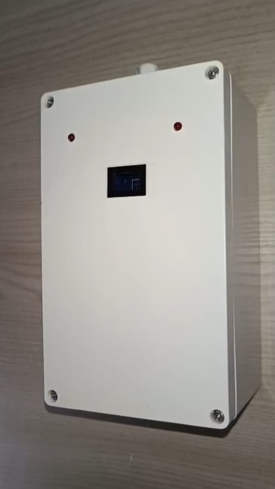
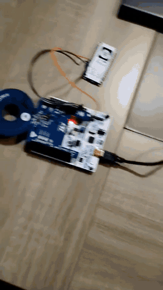
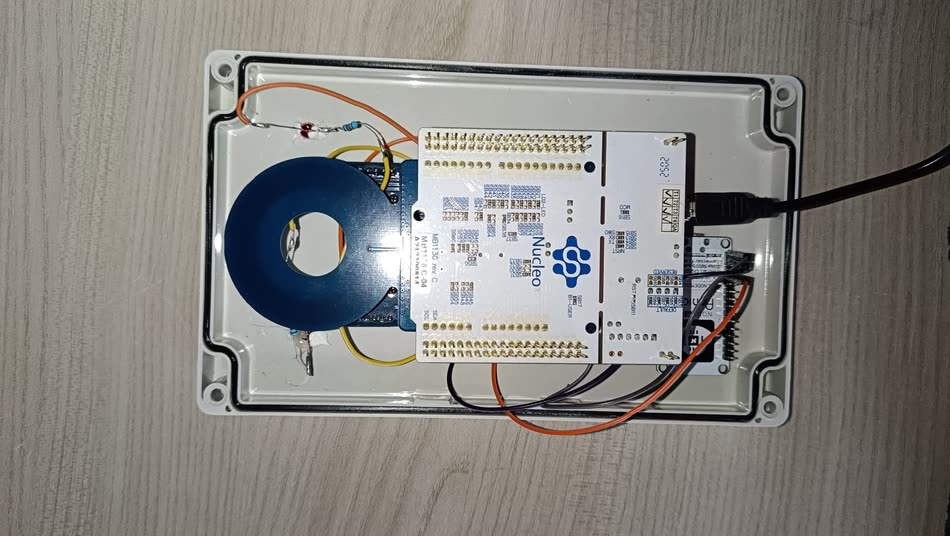
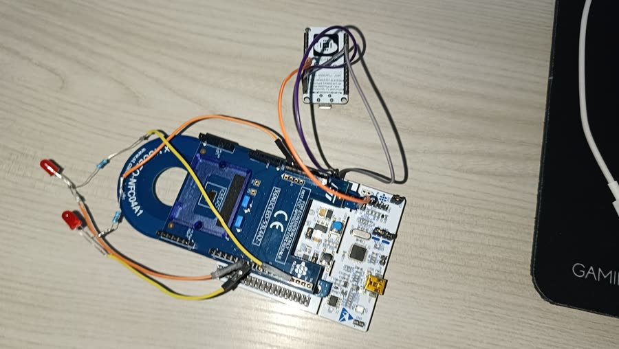

# AuthLog

An IoT access-control system that identifies a user via **RFID/NFC**, verifies the credential against a remote database, logs every attempt, and drives an electric lock — granting access only to authorized users.

> 🏆 3rd **"Salvatore Di Bartolo" Award** — ITIS "E. Fermi", Giarre.
> Submitted to the national STMicroelectronics *Build the Future with STM32ODE* contest.

<table>
<tr>
<td width="42%"></td>
<td width="58%"></td>
</tr>
<tr>
<td align="center"><sub>The reader, mounted</sub></td>
<td align="center"><sub>Enrolment: the app writes the UUID to the phone's tag</sub></td>
</tr>
</table>

The system spans four areas in a single architecture: embedded firmware, serial communication, networking/cloud, and mobile development. A particularly modern touch: the **smartphone itself acts as the NFC tag**, so no physical badges are needed.

## Why

Physical keys and offline badges are hard to keep current: revoking one means collecting it, and the device itself has to be reprogrammed by hand. Neither leaves a record of who went where.

AuthLog moves the decision off the door. Credentials are checked against a database that can be updated from anywhere, every attempt is logged for traceability, users are managed from a phone rather than at the lock, and the reader itself stays replaceable — it holds no user list and no credential of its own.

The setting this was built for is a school or a lab: places where access has to be reliable and auditable, and where changing who gets in should not require a screwdriver.

---

## How it works

1. The user taps a **phone-written NFC tag** on the reader.
2. The **STM32** detects presence with a Time-of-Flight sensor, reads the UUID, and sends it to the gateway over UART (`UUID:<uuid>`).
3. The **ESP8266** posts the UUID to a **Supabase Edge Function** over HTTPS and receives `AUTH:OK`, `AUTH:NO`, or `AUTH:ERR`.
4. The **STM32** drives the LEDs and the lock according to the verdict. `AUTH:ERR` (could not verify) is signalled separately from `AUTH:NO` (verified, denied): the lock stays shut either way, but a network fault and a rejected user are different events.
5. The Edge Function records **every** attempt in `logs`, granted or not.

```
         NFC tag (phone)
              │
              ▼
   ST25DV reader + VL53L4CD ToF
              │  (STM32 Nucleo-64 F401RE)
              │  UART 115200 8N1  ── UUID:<uuid> ──▶
              │                   ◀── AUTH:OK|NO|ERR ──
              ▼
          ESP8266 (ESP-12E)
              │  HTTPS + device token
              ▼
   Edge Function  verify-access      ← holds the service role key
              │  service role
              ▼
   Supabase — PostgreSQL  (profiles · authorized · logs)
              ▲
              │  @supabase/supabase-js + Supabase Auth
        React Native app (sign-up / login / NFC write)
```

The gateway holds **no Supabase credential**. It authenticates to the Edge Function with a per-device token, and the privileged key stays server-side — a microcontroller can be opened with a screwdriver, an Edge Function cannot.

---

## Repository layout

```
firmware/
  stm32-reader/       STM32 firmware — NFC, ToF, LEDs, lock, UART
  esp8266-gateway/    ESP8266 firmware — Wi-Fi, HTTPS, verdict relay
  k10-gateway/        UNIHIKER K10 firmware: same gateway, plus screen and sound
mobile/               React Native (Expo) app — sign-up, login, NFC write
supabase/
  functions/          verify-access Edge Function
  migrations/         database schema and RLS policies
```

Each firmware sketch lives in its own folder because the Arduino toolchain compiles every `.ino` in a folder as a single translation unit.

---

## Hardware



<sub>Inside the enclosure. The NFC antenna sits behind the front window, the ESP8266 is on the right, and the two status LEDs are wired to the front panel.</sub>

| Component | Part | Role |
|-----------|------|------|
| Microcontroller | STM32 Nucleo-64 **F401RE** | Reads NFC, local logic, lock control, ToF over I²C |
| Wi-Fi module | **ESP8266 (ESP-12E)** | Internet connectivity, Edge Function client |
| Gateway with screen (alternative) | **UNIHIKER K10** (ESP32-S3) | Replaces the ESP8266: same role, plus on-screen messages and sounds |
| NFC reader | **X-NUCLEO-NFC04A1** (ST25DV) | Reads the UUID from a phone-written tag |
| Distance sensor | **X-NUCLEO-53L4A2** (VL53L4CD) | Time-of-Flight presence detection |
| Output | LEDs + relay (electric lock) | Visual feedback and door control |



<sub>The same boards on the bench during development.</sub>

### STM32 ↔ ESP8266 link

**UART, 115200 baud, 8N1 — and it must be wired in both directions.** The reader
sends the UUID and waits for the verdict, so a transmit-only link leaves it
waiting until it times out and denies every tag.

```
STM32 PA11 (USART6 TX)  ──────▶  ESP8266 RX     UUID:<uuid>
STM32 PA12 (USART6 RX)  ◀──────  ESP8266 TX     AUTH:OK | AUTH:NO | AUTH:ERR
        GND             ◀─────▶  GND            common ground
```

PA11 and PA12 are on the morpho connector CN10 (pins 14 and 12). Do not use
D0/D1 or `Serial2`: on the Nucleo-F401RE that is USART2, the same port as
`Serial`, and it is wired to the ST-LINK USB bridge.

Both boards run at 3.3 V, so the lines connect directly — no level shifter.

### Gateway variant: UNIHIKER K10

The K10 replaces the ESP8266 and speaks the same protocol, so the STM32 only needs two wires moved. On top of relaying the verdict, it shows what is happening ("Avvicina il telefono", "Accesso consentito", "Accesso negato", "Server non raggiungibile") and plays a sound for each verdict. The reader also sends `PRESENCE:NEAR` / `PRESENCE:AWAY` when someone enters or leaves the ToF window; the K10 greets them once they have stayed 1.5 s, and the serial monitor accepts the same lines for testing without the STM32; the ESP8266 gateway ignores those lines.

```
STM32 PA11 (USART6 TX, CN10-14)  ──────▶  K10 P0 (GPIO1, RX)
STM32 PA12 (USART6 RX, CN10-12)  ◀──────  K10 P1 (GPIO2, TX)
        GND                      ◀─────▶  K10 GND
```

Use **P0 and P1** only: they are the edge pins wired straight to the ESP32-S3, while the others go through an I/O expander that cannot carry a UART. Power the K10 from its own USB-C port, not from the Nucleo.

---

## Setup

### Database

```bash
supabase db push        # review supabase/migrations/0001_schema.sql first
```

`0002_admin_logs.sql` adds administrators, who can read the access log from the app (name, verdict, date and time). Membership cannot be granted through the API; add an administrator from the SQL editor:

```sql
insert into public.admins (uuid)
select id from public.profiles where nome = '<nome>' and cognome = '<cognome>';
```

### Edge Function

```bash
supabase secrets set DEVICE_TOKEN=$(openssl rand -hex 32)
supabase functions deploy verify-access --no-verify-jwt
```

`SUPABASE_URL` and `SUPABASE_SERVICE_ROLE_KEY` are injected by the platform. Use the same `DEVICE_TOKEN` value in the gateway's `secrets.h`.

`--no-verify-jwt` is required: the gateway authenticates with its device token, which the function checks itself, and carries no Supabase JWT.

### Firmware

```bash
cp firmware/esp8266-gateway/secrets.h.example firmware/esp8266-gateway/secrets.h
# fill in Wi-Fi credentials, the endpoint, the device token, and the root CA
```

`secrets.h` is gitignored. Requires the **ArduinoJson** library and the ESP8266 Arduino core; open each sketch folder separately.

For the K10 gateway, use `firmware/k10-gateway/` the same way. Add `https://downloadcd.dfrobot.com.cn/UNIHIKER/package_unihiker_index.json` to the board manager URLs, install **UNIHIKER**, select **unihiker k10**, and set **USB CDC On Boot: Enabled** to read diagnostics over USB. Its `secrets.h.example` already carries the root certificate.

### Mobile app

```bash
cd mobile
cp .env.example .env       # fill in the URL and the publishable (anon) key
npm install
npx expo prebuild          # NFC needs a native build — Expo Go will not do
npx expo run:android
```

For an EAS cloud build, `.env` is not uploaded (it is gitignored). Set the same two variables on EAS instead; each profile in `eas.json` names the environment it reads them from:

```bash
npx eas-cli env:create --name EXPO_PUBLIC_SUPABASE_URL --value <url> --environment preview --visibility plaintext
npx eas-cli env:create --name EXPO_PUBLIC_SUPABASE_ANON_KEY --value <publishable-key> --environment preview --visibility plaintext
npx eas-cli build -p android --profile preview
```

---

## Data model

- **`profiles`** — account data (nome, cognome), keyed by the Supabase Auth user id. Credentials live in `auth.users`, hashed and managed by Supabase Auth.
- **`authorized`** — users cleared for access. An administrator inserts a profile id here; membership is what opens the door.
- **`logs`** — one row per attempt: `uuid_auth`, `granted`, `log_time`. `uuid_auth` is nullable and carries no foreign key, so attempts presenting an unknown UUID — the ones worth investigating — can still be recorded.

See [`supabase/migrations/0001_schema.sql`](./supabase/migrations/0001_schema.sql).

---

## Security

- **No credential on the device.** The gateway authenticates to the Edge Function with a device token that grants nothing but the authorization check. The service role key never leaves the function environment.
- **Row Level Security denies by default.** The app's publishable key grants nothing on its own: a signed-in user can read only their own profile and their own authorization, and `logs` is unreachable through the API.
- **Authentication is delegated to Supabase Auth**, which hashes credentials, manages sessions, and rate-limits attempts.
- **Tag content is treated as untrusted.** Anyone can write an NFC tag, so the UUID is validated against the UUID grammar on the device *and* in the Edge Function, before it reaches a query.
- **TLS certificates are verified** against a pinned root CA, with the clock synchronised over NTP first — certificate validation is meaningless without a real date.
- **Failures are not silent.** A lookup that cannot complete returns an error rather than a denial, and the reader reports it distinctly.

---

## Future work

- **Per-device tokens.** The device token is currently shared, so revoking one device means rotating all of them. A `devices` table with one token per gateway would make revocation surgical.
- **Rate limiting** on the endpoint, beyond Supabase defaults, to blunt someone brute-forcing UUIDs at the door.
- **CA bundle in flash** instead of a root pinned at compile time, so certificate rotation does not require a reflash.
- **OTA firmware updates**, so a fleet can be patched without physical access to each reader.
- **Offline fallback**: a signed, short-lived cache of authorized UUIDs would let the door keep working through a network outage.
- **Multi-door support**: provisioning, per-reader identity, and centralised audit for more than one entry point.

---

## Tech stack

`Embedded C++ (Arduino)` · `STM32` · `ESP8266` · `I²C` · `UART` · `NFC (ST25DV)` · `Time-of-Flight (VL53L4CD)` · `Supabase` · `PostgreSQL` · `Edge Functions (Deno)` · `Row Level Security` · `REST` · `HTTPS/TLS` · `React Native` · `Expo` · `TypeScript`

---

## Author

Cristian Francesco Pennino — [GitHub](https://github.com/HYP3R-08)

Licensed under the [MIT License](./LICENSE).
